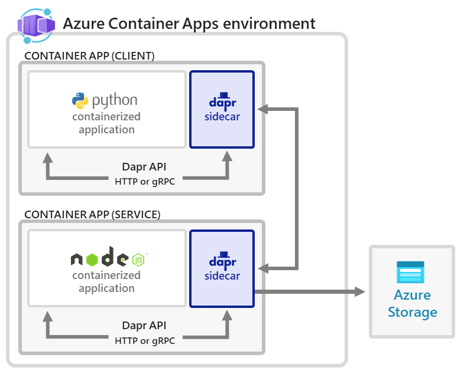

# Deploy a Dapr application to Azure Container Apps with Terraform and AzAPI Provider

[Dapr](https://dapr.io/) (Distributed Application Runtime) is a runtime that helps you build resilient stateless and stateful microservices. This sample shows how to deploy a [Dapr](https://dapr.io/) application to [Azure Container Apps](https://docs.microsoft.com/en-us/azure/container-apps/overview) using Terraform modules with the [Azure Provider](https://registry.terraform.io/providers/hashicorp/azurerm/latest/docs) and [AzAPI Provider](https://registry.terraform.io/providers/azure/azapi/latest/docs) Terraform Providers instead of an Azure Resource Manager (ARM) or Bicep template like in the original sample [Tutorial: Deploy a Dapr application to Azure Container Apps with an Azure Resource Manager or Bicep template](https://docs.microsoft.com/en-us/azure/container-apps/microservices-dapr-azure-resource-manager?tabs=bash&pivots=container-apps-bicep).

In this sample you will learn how to:

- Use the following resources from the [Azure Provider](https://registry.terraform.io/providers/hashicorp/azurerm/latest/docs):
  - [azurerm_container_app](https://registry.terraform.io/providers/hashicorp/azurerm/latest/docs/resources/container_app)
  - [azurerm_container_app_environment](https://registry.terraform.io/providers/hashicorp/azurerm/latest/docs/resources/container_app_environment)
  - [azurerm_container_app_environment_certificate](https://registry.terraform.io/providers/hashicorp/azurerm/latest/docs/resources/container_app_environment_certificate)
  - [azurerm_container_app_environment_dapr_component](https://registry.terraform.io/providers/hashicorp/azurerm/latest/docs/resources/container_app_environment_dapr_component)
  - [azurerm_container_app_environment_storage](https://registry.terraform.io/providers/hashicorp/azurerm/latest/docs/resources/container_app_environment_storage)
- Use Terraform and [AzAPI Provider](https://registry.terraform.io/providers/azure/azapi/latest/docs) to deploy or update an Azure resource using the following [data sources](https://www.terraform.io/docs/configuration/data-sources.html) and [resources](https://www.terraform.io/docs/configuration/resources.html)
  - resources:
    - [azapi_resource](https://registry.terraform.io/providers/Azure/azapi/latest/docs/resources/azapi_resource)
    - [azapi_resource_action](https://registry.terraform.io/providers/Azure/azapi/latest/docs/resources/azapi_resource_action)
    - [azapi_update_resource](https://registry.terraform.io/providers/Azure/azapi/latest/docs/resources/azapi_update_resource)
  - data sources:
    - [azapi_resource](https://registry.terraform.io/providers/Azure/azapi/latest/docs/data-sources/azapi_resource)
    - [azapi_resource_action](https://registry.terraform.io/providers/Azure/azapi/latest/docs/data-sources/azapi_resource_action)
- Create an Azure Blob Storage for use as a [Dapr](https://dapr.io/) state store
- Deploy an [Azure Container Apps environment](https://docs.microsoft.com/en-us/azure/container-apps/environment) to host one or more Azure Container Apps
- Deploy two [Dapr-enabled](https://docs.microsoft.com/en-us/azure/container-apps/dapr-overview?tabs=bicep1%2Cyaml) Azure Container Apps: one that produces orders and one that consumes orders and stores them
- Verify the interaction between the two microservices.

With Azure Container Apps, you get a [fully managed version of the Dapr APIs](./dapr-overview.md) when building microservices. When you use [Dapr](https://dapr.io/) in Azure Container Apps, you can enable sidecars to run next to your microservices that provide a rich set of capabilities. Available Dapr APIs include [Service to Service calls](https://docs.dapr.io/developing-applications/building-blocks/service-invocation/), [Pub/Sub](https://docs.dapr.io/developing-applications/building-blocks/pubsub/), [Event Bindings](https://docs.dapr.io/developing-applications/building-blocks/bindings/), [State Stores](https://docs.dapr.io/developing-applications/building-blocks/state-management/), and [Actors](https://docs.dapr.io/developing-applications/building-blocks/actors/).

In this sample, you deploy the same applications from the Dapr [Hello World](https://github.com/dapr/quickstarts/tree/master/tutorials/hello-world) quickstart.

The application consists of:

- A client (Python) container app to generate messages.
- A service (Node) container app to consume and persist those messages in a state store

The following architecture diagram illustrates the components that make up this tutorial:



## Prerequisites

- Install [Azure CLI](/cli/azure/install-azure-cli)
- An Azure account with an active subscription is required. If you don't already have one, you can [create an account for free](https://azure.microsoft.com/free/?WT.mc_id=A261C142F). If you don't have one, create a [free Azure account](https://azure.microsoft.com/free/) before you begin.
- [Visual Studio Code](https://code.visualstudio.com/) installed on one of the [supported platforms](https://code.visualstudio.com/docs/supporting/requirements#_platforms) along with the [HashiCorp Terraform](h<https://marketplace.visualstudio.com/items?itemName=HashiCorp.terraform).>

## Terraform Providers

The [Azure Provider](https://registry.terraform.io/providers/hashicorp/azurerm/latest/docs) can be used to configure infrastructure in [Microsoft Azure](https://azure.microsoft.com/en-us/) using the Azure Resource Manager API's. For more information on the [data sources](https://www.terraform.io/docs/configuration/data-sources.html) and [resources](https://www.terraform.io/docs/configuration/resources.html) supported by the Azure Provider, see the [documentation](https://registry.terraform.io/providers/hashicorp/azurerm/latest/docs). To learn the basics of Terraform using this provider, follow the hands-on [get started tutorials](https://learn.hashicorp.com/tutorials/terraform/infrastructure-as-code?in=terraform/azure-get-started). If you are interested in the [Azure Provider](https://registry.terraform.io/providers/hashicorp/azurerm/latest/docs)'s latest features, see the [changelog](https://github.com/hashicorp/terraform-provider-azurerm/blob/main/CHANGELOG.md) for version information and release notes.

The [AzAPI Provider](https://registry.terraform.io/providers/azure/azapi/latest/docs) is a very thin layer on top of the Azure ARM REST APIs. This provider compliments the [AzureRM provider](https://registry.terraform.io/providers/hashicorp/azurerm/latest/docs) by enabling the management of Azure resources that are not yet or may never be supported in the AzureRM provider such as private/public preview services and features. The [AzAPI provider](https://docs.microsoft.com/en-us/azure/developer/terraform/overview-azapi-provider) enables you to manage any Azure resource type using any API version. This provider complements the AzureRM provider by enabling the management of new Azure resources and properties (including private preview). For more information, see [Overview of the Terraform AzAPI provider](https://docs.microsoft.com/en-us/azure/developer/terraform/overview-azapi-provider).

## Terraform modules

This sample contains Terraform modules to create the following resources:

- [Microsoft.OperationalInsights/workspaces](https://docs.microsoft.com/en-us/azure/templates/microsoft.operationalinsights/workspaces): an [Azure Log Analytics](https://docs.microsoft.com/en-us/azure/azure-monitor/logs/log-analytics-workspace-overview) workspace used to collect logs and metrics of the [Azure Container Apps environment](https://docs.microsoft.com/en-us/azure/container-apps/environment).
- [Microsoft.Insights/components](https://docs.microsoft.com/en-us/azure/templates/microsoft.insights/components): an [Azure Application Insights](https://docs.microsoft.com/en-us/azure/azure-monitor/app/app-insights-overview) used by the Azure Container Apps for logging and distributed tracing.
- [Microsoft.Storage/storageAccounts](https://docs.microsoft.com/en-us/azure/templates/microsoft.storage/storageaccounts): this storage account is used to store state of the Dapr component.
- [Microsoft.App/managedEnvironments](https://docs.microsoft.com/en-us/azure/templates/microsoft.app/managedenvironments): an [Azure Container Apps environment](https://docs.microsoft.com/en-us/azure/container-apps/environment) that will host two Azure Container Apps.
- [Microsoft.App/managedEnvironments/daprComponents](https://docs.microsoft.com/en-us/azure/templates/microsoft.app/managedenvironments/daprcomponents): a [state management Dapr component](https://docs.dapr.io/developing-applications/building-blocks/state-management/state-management-overview/) that hosts the orders created by the service application.
- [Microsoft.App/containerApps](https://docs.microsoft.com/en-us/azure/templates/microsoft.app/containerapps): two dapr-enabled Container Apps: [hello-k8s-node](https://hub.docker.com/r/dapriosamples/hello-k8s-node) and [hello-k8s-python](https://hub.docker.com/r/dapriosamples/hello-k8s-python)

The following table contains the code of the `modules/contains_apps/main.tf` Terraform module used to create the Azure Container Apps environment, Dapr components, and Container Apps.

```terraform
terraform {
  required_version = ">= 1.3"
  required_providers {
    azurerm = {
      source  = "hashicorp/azurerm"
      version = "~> 3.43.0"
    }
    azapi = {
      source = "azure/azapi"
    }
  }
}

resource "azurerm_container_app_environment" "managed_environment" {
  name                           = var.managed_environment_name
  location                       = var.location
  resource_group_name            = var.resource_group_name
  log_analytics_workspace_id     = var.workspace_id
  infrastructure_subnet_id       = var.infrastructure_subnet_id
  internal_load_balancer_enabled = var.internal_load_balancer_enabled
  tags                           = var.tags
  
  lifecycle {
    ignore_changes = [
      tags
    ]
  }
}

resource "azurerm_container_app_environment_dapr_component" "dapr_component" {
  for_each                     = {for component in var.dapr_components: component.name => component}

  name                         = each.key
  container_app_environment_id = azurerm_container_app_environment.managed_environment.id
  component_type               = each.value.component_type
  version                      = each.value.version
  ignore_errors                = each.value.ignore_errors
  init_timeout                 = each.value.init_timeout
  scopes                       = each.value.scopes

  dynamic "metadata" {
    for_each                   = each.value.metadata != null ? each.value.metadata : []
    content {
      name                     = metadata.value.name
      secret_name              = try(metadata.value.secret_name, null)
      value                    = try(metadata.value.value, null)
    }
  }

  dynamic "secret" {
    for_each                   = each.value.secret != null ? each.value.secret : []
    content {
      name                     = secret.value.name
      value                    = secret.value.value
    }
  }
}

resource "azurerm_container_app" "container_app" {
  for_each                     = {for app in var.container_apps: app.name => app}

  name                         = each.key
  resource_group_name          = var.resource_group_name
  container_app_environment_id = azurerm_container_app_environment.managed_environment.id
  tags                         = var.tags
  revision_mode                = each.value.revision_mode

  template {
    dynamic "container" {
      for_each                   = coalesce(each.value.template.containers, [])
      content {
        name                     = container.value.name
        image                    = container.value.image
        args                     = try(container.value.args, null)
        command                  = try(container.value.command, null)
        cpu                      = container.value.cpu
        memory                   = container.value.memory
        
        dynamic "env" {
          for_each               = coalesce(container.value.env, [])
          content {
            name                 = env.value.name
            secret_name          = try(env.value.secret_name, null)
            value                = try(env.value.value, null)
          }
        }
      }
    }
    min_replicas                 = try(each.value.template.min_replicas, null)
    max_replicas                 = try(each.value.template.max_replicas, null)
    revision_suffix              = try(each.value.template.revision_suffix, null)

    dynamic "volume" {
      for_each                   = each.value.template.volume != null ? [each.value.template.volume] : []
      content {
        name                     = volume.value.name
        storage_name             = try(volume.value.storage_name, null)
        storage_type             = try(volume.value.storage_type, null)
      }
    }
  }

 dynamic "ingress" {
    for_each                     = each.value.ingress != null ? [each.value.ingress] : []
    content {
      allow_insecure_connections = try(ingress.value.allow_insecure_connections, null)
      external_enabled           = try(ingress.value.external_enabled, null)
      target_port                = ingress.value.target_port
      transport                  = ingress.value.transport

      dynamic "traffic_weight"  {
        for_each                 = coalesce(ingress.value.traffic_weight, [])
        content {
          label                  = traffic_weight.value.label
          latest_revision        = traffic_weight.value.latest_revision
          revision_suffix        = traffic_weight.value.revision_suffix
          percentage             = traffic_weight.value.percentage
        }
      }
    }
  }

  dynamic "dapr" {
    for_each                     = each.value.dapr != null ? [each.value.dapr] : []
    content {
      app_id                     = dapr.value.app_id
      app_port                   = dapr.value.app_port
      app_protocol               = dapr.value.app_protocol
    }
  }

  dynamic "secret" {
    for_each                     = each.value.secrets != null ? [each.value.secrets] : []
    content {
      name                       = secret.value.name
      value                      = secret.value.value
    }
  }

  lifecycle {
    ignore_changes = [
      tags
    ]
  }
}

resource "azapi_update_resource" "containerapp" {
  type        = "Microsoft.App/containerApps@2022-10-01"
  resource_id = azurerm_container_app.container_app["pythonapp"].id

   body = jsonencode({
    properties = {
      configuration = {
        dapr = {
          appPort  = null
        }
      }
    }
  })

  depends_on = [
    azurerm_container_app.container_app["pythonapp"],
  ]
}
```

As you can see, the module uses the following resources of the [Azure Provider](https://registry.terraform.io/providers/hashicorp/azurerm/latest/docs):

- [azurerm_container_app_environment](https://registry.terraform.io/providers/hashicorp/azurerm/latest/docs/resources/container_app_environment): this resource is used to create the [Azure Container Apps environment](https://learn.microsoft.com/en-us/azure/container-apps/environment) which acts as a secure boundary around the container apps. Container Apps in the same environment are deployed in the same virtual network and write logs to the same Log Analytics workspace.
- [azurerm_container_app_environment_dapr_component](https://registry.terraform.io/providers/hashicorp/azurerm/latest/docs/resources/container_app_environment_dapr_component): the Distributed Application Runtime ([Dapr][dapr-concepts]) is a set of incrementally adoptable features that simplify the authoring of distributed, microservice-based applications. For example, Dapr provides capabilities for enabling application intercommunication, whether through messaging via pub/sub or reliable and secure service-to-service calls. Once Dapr is enabled for a container app, a secondary process will be created alongside your application code that will enable communication with Dapr via HTTP or gRPC. This component is used to deploy a collection of Dapr components defined in the `dapr_components` variable. This sample deploys a single [State Management](https://docs.dapr.io/developing-applications/building-blocks/state-management/state-management-overview/) Dapr component that uses an [Azure Blob Storage](https://docs.dapr.io/reference/components-reference/supported-state-stores/setup-azure-blobstorage/) as a state store.
- [azurerm_container_app](https://registry.terraform.io/providers/hashicorp/azurerm/latest/docs/resources/container_app): this resource is used to deploy a configurable collection of [Azure Container Apps](https://learn.microsoft.com/en-us/azure/container-apps/overview) in the [Azure Container Apps environment](https://learn.microsoft.com/en-us/azure/container-apps/environment). The container apps are defined in the `container_apps` variable.

When the [Azure Provider](https://registry.terraform.io/providers/hashicorp/azurerm/latest/docs) does not provide the necessary [data sources](https://www.terraform.io/docs/configuration/data-sources.html) and [resources](https://www.terraform.io/docs/configuration/resources.html) to create Azure resources or the existing data sources and resources do not yet expose a block or property, you can use the data sources and resources of the [AzAPI Provider](https://registry.terraform.io/providers/azure/azapi/latest/docs) to create or modify Azure resources.

At the time of this writing, the `app_port` property under the `dapr` block in the `azurerm_container_app` resource is defined as required. You should be able to set the value of this property to `null` to create headless applications, like the `pythonapp` in this tutorial, with no ingress, hence, with no `app_port`. I submitted a [pull request](https://github.com/hashicorp/terraform-provider-azurerm/pull/20567) to turn the the `app_port` property under the `dapr` block in the `azurerm_container_app` resource from required to optional. While waiting for the pull request to be accepted, as a temporary solution we can use an [azapi_update_resource](https://registry.terraform.io/providers/Azure/azapi/latest/docs/resources/azapi_update_resource) resource of the [AzAPI Provider](https://registry.terraform.io/providers/azure/azapi/latest/docs) to set the [appPort](https://learn.microsoft.com/en-us/azure/templates/microsoft.app/containerapps?pivots=deployment-language-terraform) of the `pythonapp` container app to null after creating the resource with the [azurerm_container_app](https://registry.terraform.io/providers/hashicorp/azurerm/latest/docs/resources/container_app) of the [Azure Provider](https://registry.terraform.io/providers/hashicorp/azurerm/latest/docs)

## AzAPI Provider

The `azapi` folder of the companion project contains an old version of the sample where the Container App environment, Container Apps, and Dapr component used by the sample are all deployed using [azapi_resource](https://registry.terraform.io/providers/Azure/azapi/latest/docs/resources/azapi_resource) resources of the [AzAPI Provider](https://registry.terraform.io/providers/azure/azapi/latest/docs). Below you can see the code of the `azapi/modules/container_apps/main.tf`module.

```terraform
terraform {
  required_version = ">= 1.3"
  required_providers {
    azurerm = {
      source  = "hashicorp/azurerm"
      version = "~> 3.43.0"
    }
    azapi = {
      source  = "Azure/azapi"
    }
  }
  experiments = [module_variable_optional_attrs]
}

locals {
  module_tag = {
    "module" = basename(abspath(path.module))
  }
  tags = merge(var.tags, local.module_tag)
}

resource "azapi_resource" "managed_environment" {
  name      = var.managed_environment_name
  location  = var.location
  parent_id = var.resource_group_id
  type      = "Microsoft.App/managedEnvironments@2022-03-01"
  tags      = local.tags
  
  body = jsonencode({
    properties = {
      daprAIInstrumentationKey = var.instrumentation_key
      appLogsConfiguration = {
        destination = "log-analytics"
        logAnalyticsConfiguration = {
          customerId = var.workspace_id
          sharedKey  = var.primary_shared_key
        }
      }
    }
  })

  lifecycle {
    ignore_changes = [
        tags
    ]
  }
}

resource "azapi_resource" "daprComponents" {
  for_each  = {for component in var.dapr_components: component.name => component}

  name      = each.key
  parent_id = azapi_resource.managed_environment.id
  type      = "Microsoft.App/managedEnvironments/daprComponents@2022-03-01"

  body = jsonencode({
    properties = {
      componentType   = each.value.componentType
      version         = each.value.version
      ignoreErrors    = each.value.ignoreErrors
      initTimeout     = each.value.initTimeout
      secrets         = each.value.secrets
      metadata        = each.value.metadata
      scopes          = each.value.scopes
    }
  })
}

resource "azapi_resource" "container_app" {
  for_each  = {for app in var.container_apps: app.name => app}

  name      = each.key
  location  = var.location
  parent_id = var.resource_group_id
  type      = "Microsoft.App/containerApps@2022-03-01"
  tags      = local.tags

  body = jsonencode({
    properties: {
      managedEnvironmentId  = azapi_resource.managed_environment.id
      configuration         = {
        ingress             = try(each.value.configuration.ingress, null)
        dapr                = try(each.value.configuration.dapr, null)
      }
      template              = each.value.template
    }
  })

  lifecycle {
    ignore_changes = [
        tags
    ]
  }
}
```

You can use an [azapi_resource](https://docs.microsoft.com/en-us/azure/developer/terraform/overview-azapi-provider) resource to create any Azure resource. For more information, see [Overview of the Terraform AzAPI provider](https://docs.microsoft.com/en-us/azure/developer/terraform/overview-azapi-provider).

## Deploy the sample

All the resources deployed by the modules share the same name prefix. Make sure to configure a name prefix by setting a value for the `resource_prefix` variable defined in the `variables.tf` file. If you set the value of the `resource_prefix` variable to an empty string, the `main.tf` module will use a `random_string` resource to automatically create a name prefix for the Azure resources. You can use the `deploy.sh` bash script to deploy the sample:

```bash
#!/bin/bash

# Terraform Init
terraform init

# Terraform validate
terraform validate -compact-warnings

# Terraform plan
terraform plan -compact-warnings -out main.tfplan

# Terraform apply
terraform apply -compact-warnings -auto-approve main.tfplan
```

This command deploys the Terraform modules that create the following resources:

- The Container Apps environment and associated Log Analytics workspace for hosting the hello world Dapr solution.
- An Application Insights instance for Dapr distributed tracing.
- The `nodeapp` app server running on `targetPort: 3000` with dapr enabled and configured using: `"appId": "nodeapp"` and `"appPort": 3000`.
- The `daprComponents` object of `"type": "state.azure.blobstorage"` scoped for use by the `nodeapp` for storing state.
- The headless `pythonapp` with no ingress and Dapr enabled that calls the `nodeapp` service via dapr service-to-service communication.

## Verify the result

### Confirm successful state persistence

You can confirm that the services are working correctly by viewing data in your Azure Storage account.

1. Open the [Azure portal](https://portal.azure.com) in your browser.
1. Navigate to your storage account.
1. Select **Containers** from the menu on the left side.
1. Select **state**.
1. Verify that you can see the file named `order` in the container.
1. Select on the file.
1. Select the **Edit** tab.
1. Select the **Refresh** button to observe updates.

### View Logs

Data logged via a container app are stored in the `ContainerAppConsoleLogs_CL` custom table in the Log Analytics workspace. You can view logs through the Azure portal or from the command line. Wait a few minutes for the analytics to arrive for the first time before you query the logged data.

1. Open the [Azure portal](https://portal.azure.com) in your browser.
1. Navigate to your log analytics workspace.
1. Select **Logs** from the menu on the left side.
1. Run the following Kusto query.

```kql
ContainerAppConsoleLogs_CL 
| project TimeGenerated, ContainerAppName_s, Log_s
| order by TimeGenerated desc
```

The following images shows the type of response to expect from the command.


## Clean up resources

Once you are done, run the following command to delete your resource group along with all the resources you created in this tutorial.

```bash
az group delete \
  --resource-group $RESOURCE_GROUP
```

Since `pythonapp` continuously makes calls to `nodeapp` with messages that get persisted into your configured state store, it is important to complete these cleanup steps to avoid ongoing billable operations.

## Next steps

- [Azure Container Apps overview](https://docs.microsoft.com/en-us/azure/container-apps/overview)
- [Tutorial: Deploy a Dapr application to Azure Container Apps with an Azure Resource Manager or Bicep template](https://docs.microsoft.com/en-us/azure/container-apps/microservices-dapr-azure-resource-manager?tabs=bash&pivots=container-apps-bicep)
- [AzAPI provider](https://docs.microsoft.com/en-us/azure/developer/terraform/overview-azapi-provider)
- [Announcing Azure Terrafy and AzAPI Terraform Provider Previews](https://techcommunity.microsoft.com/t5/azure-tools-blog/announcing-azure-terrafy-and-azapi-terraform-provider-previews/ba-p/3270937)
